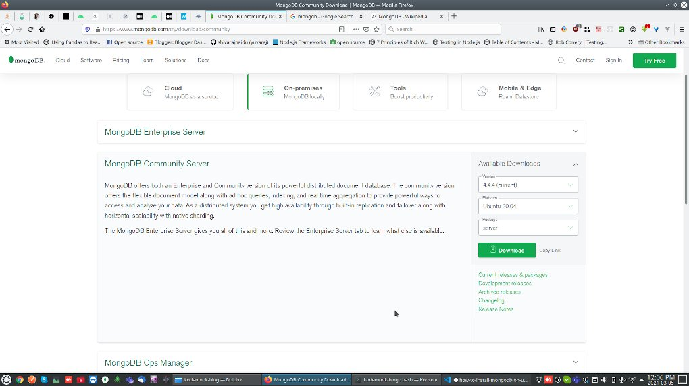

MongoDb is one of the most popular opensource NoSQL databases avilable today.
Well Known for its great scalability with shardings and fast data processing capabilities with json like document objects and collections.

It also has pwerfull *Aggregation* framework and cool features like [TTL](https://en.wikipedia.org/wiki/Time_to_live) and *Capped Collections*

You can learn more about mongodb [here..](https://docs.mongodb.com/manual/) 

In this post we are going to see how to install community version of mongo database server, mongo shell and perform basic operations on mongodb.


## Step 1: Download required packages from mongodb official site

  - Go to [Mongodb downloads](https://www.mongodb.com/try/download/community) 
  - Select *Ubunutu 20.04*, select *server* package and download server deb file
  - Select *Ubunutu 20.04*, select *shell* package and download deb file




## Step 2: Install downloaded packages
Update your package list..

```bash
sudo apt update
```

Keep downloaded deb files into sperate folder, `cd` into that directory and then execute below command to install the downloaded packages.

```bash
sudo dpkg -i *.deb
```

if you get any dependency errors run below commands

```bash
sudo apt -f install && sudo apt -y upgrade
```

## Check the mongodb status using systemctl command
Afeter succesfull installtion you can checck the status of mongodb server using `sudo systemctl status mongod`
if your mongodb installtion shows `inactive` status you can start the service using `sudo systemctl start mongod`.

Additionally you can also set mongodb serice to auto start when you turn on your system by using following command `sudo systemctl enable mongod`

## How to use mongodb through shell 
You can find how to conenct mongo shell to mongodb, create, delete database and collections etc in the below video..

`youtube: https://www.youtube.com/watch?v=9OpnhrgHAB0`

you can alos refer my old [blog post](https://opensourceinside.kodemonk.dev/2016/07/how-to-install-use-mongodb-on-ubuntu.html#basic-usage-of-mongodb-on-ubuntu) about using mongodb thrugh shell on ubuntu linux.

*Thank You !*
