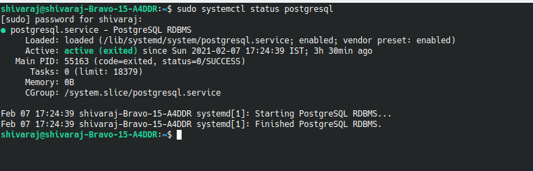
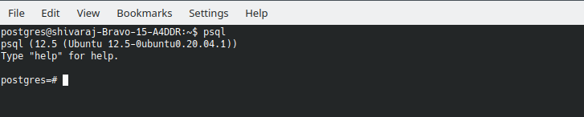

**PostgreSQL** is a powerful, open source object-relational database system and known for its strong reputation for reliability, feature robustness, and performance.  

Also includes built-in support for regular [B-tree](https://en.wikipedia.org/wiki/B-tree) and [hash table](https://en.wikipedia.org/wiki/Hash_table) indexes etc.. Indexes in PostgreSQL also support the following features:

- Expression indexes can be created with an index of the result of an expression or function, instead of simply the value of a column.
    
- k-nearest neighbors (k-NN) indexing (also referred to KNN-GiST[33]) provides efficient searching of "closest values" to that specified, useful to finding similar words, or close objects or locations with geospatial data. This is achieved without exhaustive matching of values.

- Index-only scans often allow the system to fetch data from indexes without ever having to access the main table.
- PostgreSQL 9.5 introduced Block Range Indexes (BRIN).

This also includes built-in binary replication based on shipping the changes [(write-ahead logs (WAL))](https://en.wikipedia.org/wiki/Write-ahead_logging) to replica nodes asynchronously, with the ability to run read-only queries against these replicated nodes. This allows splitting read traffic among multiple nodes efficiently.

In this post we are going to see how to install (verify the setup) and browse the data in PostgreSQL.

Ubuntu 20.04 LTS includes PostgreSQL as part of its official repository of apps. so that we can install it direcctly without adding any extra PPA's

## Step 1: Install PostgreSQL
Update your package list and install the PostgreSQL.

```bash
sudo apt update
sudo apt install postgresql postgresql-contrib
```
`postgresql-contrib` package will give some more utilities and tools to manage/use Postgresql 

## Step 2: Verify The setup
Verify the installtion by printing the version

```bash
sudo -u postgres psql -c "SELECT version();"
```
If the installation is successfull, You will see output something similar to the one shown below

```bash
                                                            version                                                               
-------------------------------------------------------------------------------------------------------------------------------------
 PostgreSQL 12.5 (Ubuntu 12.5-0ubuntu0.20.04.1) on x86_64-pc-linux-gnu, compiled by gcc (Ubuntu 9.3.0-17ubuntu1~20.04) 9.3.0, 64-bit
(1 row)

```

You can also check the status of postgreql using `systemctl` command

```bash
sudo systemctl status postgresql
```
You'll see something similar to the below one if it is running properly..


## Step 3: Connect And Create, List Databases

The successfull installation of PostgreSQL will have created new user (`postgres`). We can switch to that user using following command `sudo -i -u postgres` and connect to the db using `psql` command.



Now we can create teh database using `CREATE DATABASE dbname;` and list the databases using `\l` or `\list`
If you want to delete the database, you can use `DROP DATABASE dbname;`

You can connect to the database using `\c dbname;`

***Note: Dont't forget to put semicolon (;) at the end of the command***

## Basic CRUD operations

Next we will see how to Insert, update, read and delete data in postgresql database

Let's create new database with name `tinydb` and table called `tinylinks` with following fields 

- `original_url` - URL that we are want to make short
- `slug` - tiny url slug (a unique value)

```bash
CREATE TABLE tinylinks(                                                                            
original_url VARCHAR(255) NOT NULL,
slug VARCHAR(255) NOT NULL UNIQUE
);
```

Insert data into the table use `INSERT` statement

```bash
INSERT INTO tinylinks (original_url, slug) VALUES ('https://kodemonk.com/abc?q=123somelongurltext', 'kodeemonk');
```

To bulk insert...

```bash
INSERT INTO tinylinks (original_url, slug) VALUES ('https://kodemonk.com/somelingtext', 'kodemonk-a'), ('https://fb.com/somelogongtexttttt', 'fbslt');
```

You can list the data from the table using `SELECT` statement

```bash
SELECT * FROM tinylinks;
```

You can update specific data using `UPDATE` statement with `WHERE` condition

```bash
UPDATE tinylinks SET slug = 'kodeemonk' WHERE slug = 'kodemonk';
```

To delete use `DELETE` sttement
```bash
DELETE FROM tinylinks WHERE slug = 'kodemonk';
```

You can also see the 

`youtube: https://www.youtube.com/watch?v=9UqEFKmA7mM`

`youtube: https://www.youtube.com/watch?v=vEvDJMg9ixU`