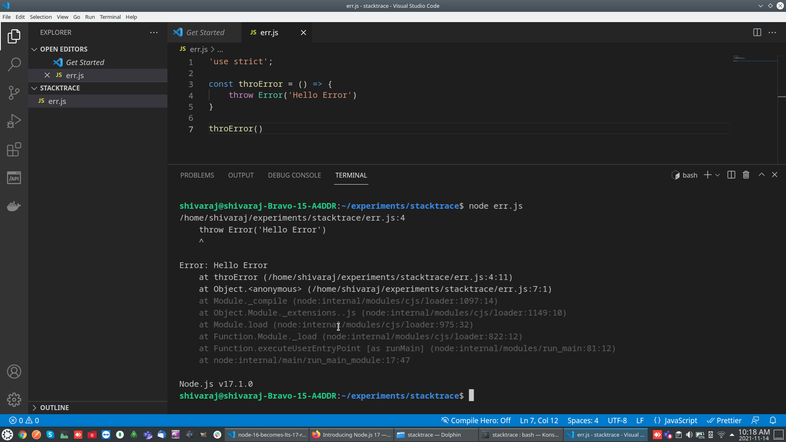

We all know that Node 16 has been released at early 2021 and now it becomes LTS.. Maybe its time to upgrade our production systems. Along with this the NodeJs team also moved NodeJs 17 to current release line.

Back in April, I have posted new changes/features that are being introduced in NodeJs 16
Just summarizing those updates here..

- Updated Platform support
- V8 JavaScript Engine Version 9
- N-API Version 8
- Stable Timers Promises API
- Async Local Storage APIs

If you want to know read more about Node 16 release changes, Please read [my previous blog post](/blog/nodejs-16-released)

Now we will see what are the some exciting things happening in Node eco-system with the release of NodeJs 17...

- OpenSSL 3.0 support
- Node.js version in stack traces
- V8 JavaScript Engine Version 9.5
- New promisified APIs

## OpenSSL 3.0 support
Previous NodeJs comes with OpenSSL 1.1 now the latest NodeJs(17) released with OpenSSL 3.0 which is mostly compatible with OpenSSL 1.1.
For more details on the OpenSSL 3.0 release please see the [OpenSSL 3.0 release post](https://www.openssl.org/blog/blog/2021/09/07/OpenSSL3.Final/).

## Node.js version in stack traces
The new NodeJs 17 release comes with more imroved error stacks for fatal errors.
when there is an unhandled erorr now the new node will print NodeJs Version along with the stack trace. this seems very small but very useful update.



## V8 JavaScript Engine Version 9.5
Each major release brings with it an updated version of the V8 JavaScript engine along with better performance and new features. One of the interesting new features is the addition of an error cause.

Being able to better nest errors also helps with diagnostics. As an example:
```js
const e1 = new Error('Error 1');
const e2 = new Error('Error 2', { cause: e1 });
e1 === e2.cause; // true
```
You can read more details in the V8 9.5 [release post](https://v8.dev/blog/v8-release-95).

## More promisified APIs
NodeJs devlopers started offering promise based versions of built in apis.. now with the release of NodeJs 17 we got more promisified apis.

In Node.js 17, they introduce promise-based APIs for the Readline module. The readline module provides an interface for reading data from a Readable stream (such as process.stdin) one line at a time.

The following simple example illustrates the basic use of the readline module:

```js
import * as readline from 'node:readline/promises';
import { stdin as input, stdout as output } from 'process';
const rl = readline.createInterface({ input, output });
const answer = await rl.question('What do you think of Node.js? ');
console.log(`Thank you for your valuable feedback: ${answer}`);
rl.close();
```

## See how to intall multiple versions of nodejs in your linux system...
`youtube: https://www.youtube.com/watch?v=LPosVQH20D0`
