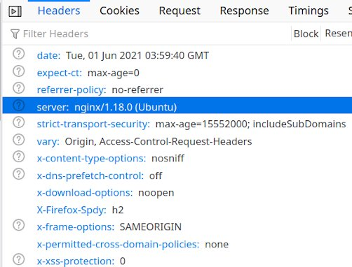

NginX, is a popular cross platform opensource web server that can also be used as a reverse proxy, load balancer, mail proxy and HTTP cache. The software was created by Igor Sysoev and publicly released in 2004.A large fraction of web servers use NGINX, often as a load balancer.

In this post we are going to discuss how we can *change / remove **Server** header* from the *HTTP response* sent by nginx setup (on Ubunut) by changing the configuration.

Generally we will get server name and version along with the response like the one shown below..

Now we will see
- How to remove nginx version from server header
- How to remove the server header altogether
- How to change or set custom server name to server header in the nginx

## Removing nginx version from server header
- Go to nginx config folder (`cd /etc/nginx/`) and open the configuration file (`nginx.conf`)
- Add `server_tokens off;` under *http* section.
- Restart Nginx webserver (`sudo systemctl restart nginx`)
- Now verify the response you will see only server name not the version of nginx.

## Removing server header from response
- Install `nginx extras` module with the following command `sudo apt install nginx-extras`
- Go to nginx config folder (`cd /etc/nginx/`) and open the configuration file (`nginx.conf`)
- Add `more_clear_headers Server;` under *http* section.
- Restart Nginx webserver (`sudo systemctl restart nginx`)
- Now verify the response you will see only server name not the version of nginx.

## Setting custom server name to the server header
- Install `nginx extras` module with the following command `sudo apt install nginx-extras`
- Go to nginx config folder (`cd /etc/nginx/`) and open the configuration file (`nginx.conf`)
- Add `more_set_headers 'Server: MyServer';` under *http* section.
- Here `MyServer` can be any custom string without any special characters (Spaces and numbers are allowed).
- Restart Nginx webserver (`sudo systemctl restart nginx`)
- Now verify the response you will see only server name not the version of nginx.
