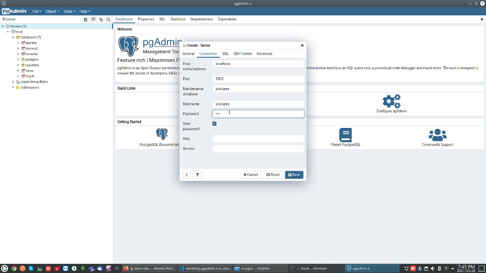

MongoDb is one of the most popular opensource NoSQL databases avilable today.
Known for its great scalability and fast data processing capabilities with json like document objects and collections. Learn more about mongodb [here..](https://en.wikipedia.org/wiki/MongoDB) 

In this post we are going to see how to install comunity version of mongo database server, mongo shell, compas and perform basic operations on mongodb.


## Step 1: Add official pgAdmin PPA and update package list
Before adding PPA we have to add public key for the same.

```bash
sudo curl https://www.pgadmin.org/static/packages_pgadmin_org.pub | sudo apt-key add
```

And then add [PPA](https://askubuntu.com/questions/4983/what-are-ppas-and-how-do-i-use-them/4990#4990) and update the package list

```bash
sudo sh -c 'echo "deb https://ftp.postgresql.org/pub/pgadmin/pgadmin4/apt/$(lsb_release -cs) pgadmin4 main" > /etc/apt/sources.list.d/pgadmin4.list && apt update'
```

## Step 2: Install pgAdmin 4

```bash
sudo apt install pgadmin4
```

## Step 3: Setup master password and connect database server
After successful installation we can find the pgAdmin shortcut in in our application menu.
We can open it by clicking on the app icon and pgAdmin will ask us to set master password which will be used to securely save and retrieve our database usernames and passwords.

After setting master password you can enter your database username and password to connect to the database server.

While installing PostgreSQL it will automatically created user with name *postrges* without any password.
(You can see [how to install PostgreSQL in ubuntu 20.04](https://kodemonk.dev/blog/installing-postgresql-on-ubuntu-20-04) here.. )

Now we can set password for that user as well as to the user in database server.

you can set the password to user in your linux system like this..
```bash
sudo passwd postgres 
```
and then switch to that user (postgres) using `su postgres
` and alter the database user password using below command

```bash
psql -c "ALTER USER postgres PASSWORD 'root';"
```

Now you can connect to your database server using this username and password within pgAdmin



If the connection is successful you can see the list of databases

You can see more about how to get start with pgAdmin through the below [Youtube](https://www.youtube.com/c/KodeMonk) videos.. You can also find more videos like this on our youtube [channel](https://www.youtube.com/c/KodeMonk).

### How to use pgAdmin 4
`youtube: https://www.youtube.com/watch?v=1KuDrATYj20`

### How to install pgAdmin 4
`youtube: https://www.youtube.com/watch?v=d5v5Ze_Wvus`


